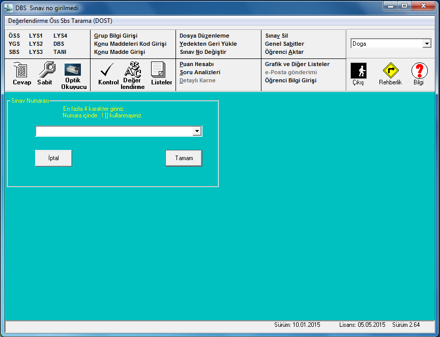

# Dat to CSV Converter for Sekonic OMR Software

## Overview
This tool serves as a backup solution for processing data from the Sekonic SR-1800 Optical Mark Reader (OMR) software used at our workplace. Sometimes the official software may fail to generate spreadsheet files from scanned optical papers, even though it can produce `.dat` files with the scan results. This converter takes those `.dat` files, along with corresponding `.key` files containing the answer keys, and generates a `.csv` file listing student IDs and their calculated scores.



## Installation

### Prerequisites
- **Go Programming Language**: This tool is implemented in Go. Ensure you have Go installed on your system to compile and execute the program. Go can be downloaded from the [official Go website](https://golang.org/dl/).

### Compiling the Program
1. **Clone the Repository**: First, clone the repository to your local machine or download the source code directly. Use the following command to clone the repository:
    ```sh
    git clone https://github.com/gusanmaz/opticsv.git
    cd optikcsv
    ```

2. **Build the Program**: Compile the source code using the Go compiler. This will generate an executable file named `opticsv` (or `opticsv.exe` on Windows systems).
    ```sh
    go build -o opticsv
    ```

### Running the Program
The program requires the `-filename` argument to specify the base name of the `.dat` and `.key` files (without their extensions). For instance, if your files are named `exam1.dat` and `exam1.key`, execute the program as follows:
```sh
./opticsv -filename exam1
```
This command will process the exam1.dat and exam1.key files located in the current directory and generate an exam1.csv file with student scores.
Usage

The tool is designed to be straightforward. Specify the base filename of your .dat and .key files using the -filename flag when running the program from the command line. The tool will automatically calculate the scores based on the provided answer keys and generate a .csv file with the results.
Configuration

#### .dat File

.dat files are special files that are generated by Sekonic SR-1800 Optical Mark Reader (OMR) software when someone reads optical papers.
Aformentioned software uses .dat files to generate Excel files that are more readable. However, I personally find generating Excel files
from this software clunky and this is one of the reasons why I created this program. Below you would find an example anonymized dat file.

```text
MERT KARADENIZ      2  8473621956BADEBCCBECBAABDDDBEAEDCAAEBDADDAACDBBDDCDEADBCADECC                                                                      
FATMA SÖNMEZ        2  5387906214CCDCACEADBEAECBEAEDECEAADEEDEADBCABCABCCCADECBCDBBD                                                                      
CAN DEMIR           2  4928753160CAACAEDAEBEAEEDBBECECBAADACDEDBDEDABADECCADACEBDABD
AYŞE KAYA           2  7364829517ADCBBDDADBECEBEABEADECDAAABCAADABEBEDECEADAEADCABDA                                                                      
BURAK ÖZTÜRK        2  6214738590BBDEBCCBEDBCABABDBEAECBECABBAEDDACABBADCDEADBAADCCC                                                                      
HÜSEYIN YILDIZ      2  8347692513BADECCCBEACDEBBEDBEAEDCAACBBAEDAACDBBDACDEADACADECC                                                                      
BATUHAN DEMIREL     2  9753164820DADEBECCEADBBDAADCCEACADECCECCDBBDBEAECDDBEAEBCABED                                                                      
BESTE ARSLAN        2  8573916248AADBBDDCADECADEDBEAEECDABABEAEBADEBCDCCEADBEACAADBA                                                                      
FARUK EGE AKIN      2  6482591736CCACEBDADBEAECBEAEDEAEAADEBDEADBCDCDEBCCCADECBCDBBD                                                                      
UTKU HAKAN KOÇ      2  3196874521CCECBADAEBECDBDCBEDAAEAAEABDDADBEDCCECCCAACEDADDBBD
```

#### .key File

Key file needs to be created by user to store answers to exam question. Below is an example .key file

```text
EBECAABDDAEDCDACBDBEDCCBACDDECBBEADDEEDCBACACDEDEEBC
DCDEDBECCADBBEDECCEDBBDBACEABDDCBEDDBAEDABEADBEEECBD
BACABDEACACDEBBDCEBBACDBDDCAEACABDCBDECDDBEEBBCCBDAA
EDDCDEBEAADCCDDBBCAEDDACCABEDDABBDCDBBAAACDCCDACADBC
```

Above top row is answer key for sheet:A, The row one below is answer key for sheet: B and bottom row is answer key for sheet D.
Notice there are 50 questions on the exam for which this .key file is created. For sheet A answer to first question is E and 
answer to last three questions are E, B, C consecutively.

Below is another example .key file. This time there is only sheet A and there are only 10 questions. 

```text
ABCDEAABBC
```

Below is another example .key file. This time not all questions worth the same. Second question's point value of 19 is 
indicated in key file. To sum total point value to 100 other questions point value is set to 9 by the program if default
value of 100 for total points is not overwritten with CLI argument.

```text
AB:19CDEAABBC
```

You could set point value of any question by appending :{number} after answer to that question. You could use this feature
for both single line and multiline (multiple question sheet exam) key file.


The program automatically determines the number of questions from the length of the answer keys in the .key file and assumes each exam's total score is 100 points if it is not altered via CLI argument, distributing the points evenly across all questions after setting predetermined points to indicated questions in key file.
### Notes

The tool gracefully handles cases where student numbers are incomplete or certain answers are left unmarked, ensuring these instances are reported but not included in the final .csv file.
For exams with multiple versions of answer sheets, the .key file can contain multiple lines, each corresponding to a different version (A, B, C, D, etc.).

### Author

Güvenç Usanmaz

### License

This project is licensed under the MIT License - see the LICENSE.md file for details.